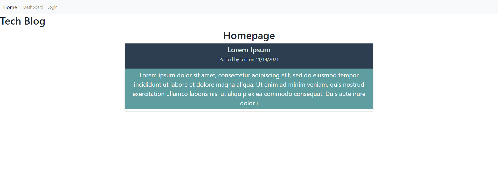
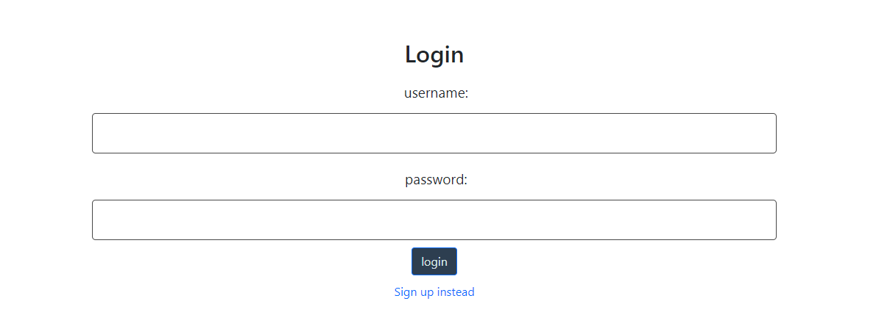
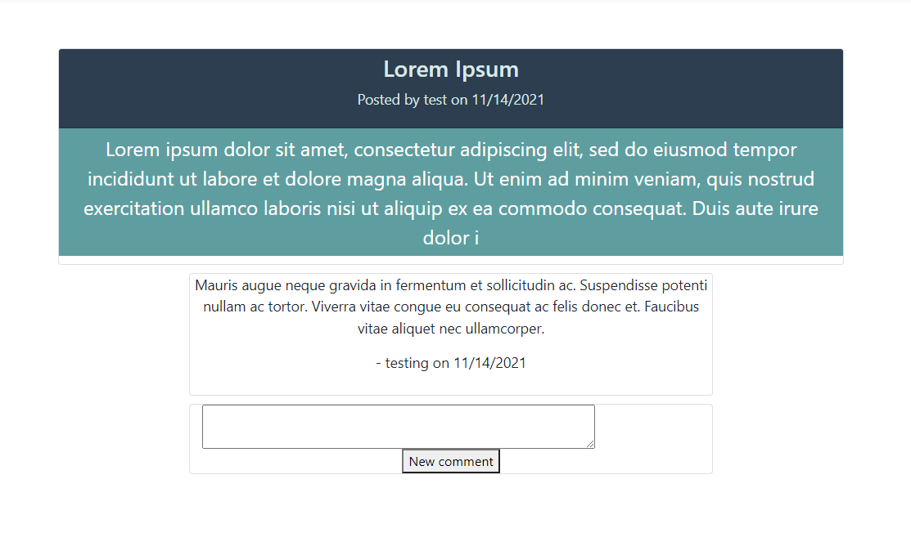
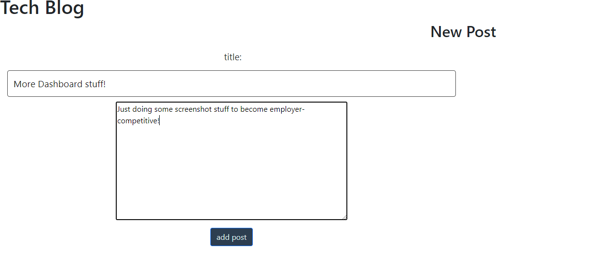
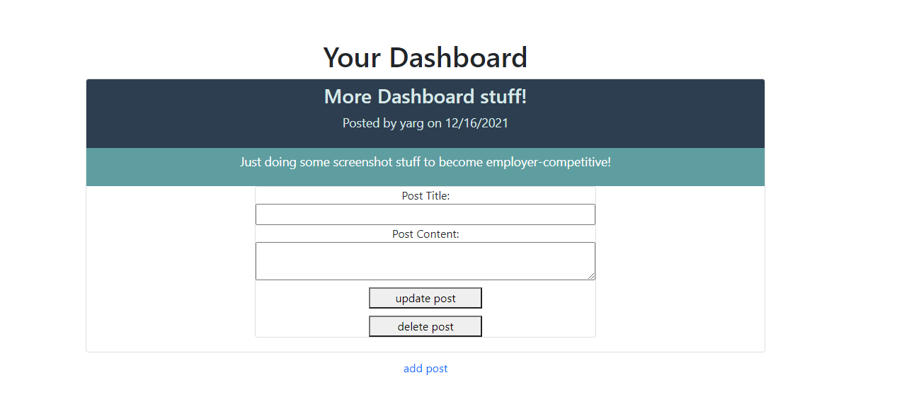

# Tech-Blog


# Table of Contents

1. [Description](#description)<br>
2. [Installation](#installation)<br>
3. [License](#license)<br>
4. [Deployment](#deployment)<br>
5. [Tests](#tests)<br>
6. [Contribute](#contributing)<br>
7. [Built Using](#built-using)<br>
8. [Credits](#credits)<br>
9. [Questions](#questions) 


# Description
This is a fullstack application that involves the use of a mysql database, an express server, and handlebars for HTML generation. This application is a blog website that allows users to make an account and login with their own account. It also allows user to make post threads and comments on those post threads for all users to see. It also allows users to delete their own post threads and comments.


# Installation
Please make sure you have node.js installed on your machine! <br>

mysql2 installation: <br>
```shell
npm i mysql2
```
sequelize: <br>
```shell
npm i sequelize
```
express installation: <br>
```shell
npm i express
```
express-handlebars installation: <br>
```shell
npm i express-handlebars:
```
connect-session-sequelize installation: <br>
```shell
npm i connect-session-sequelize:
```
moment installation: <br>
```shell
npm i moment
```
Once you have these things installed, you must have a mysql database running on your system, replace the values for the host, database name, and password to the database in order to connect to your own database.
# License

This repo is covered under the MIT License.
<br>[License](https://choosealicense.com/licenses/mit/)

# Deployment
Deployed at: <https://tech-blog-ec.herokuapp.com/> <br>

Home Page:


Login Form:


Post Details Page:


Post Form Page:


Dashboard Page:


# Tests

Initialize app using:
```shell
node server.js
```
APIs were tested using Insomnia:
<https://insomnia.rest/>

# Contributing

Feel free to open a pull request or open an issue

# Built Using

node js: <https://nodejs.org/en/> <br>
express.js: <https://expressjs.com/en/starter/installing.html> <br>
mysql2: <https://www.npmjs.com/package/inquirer> <br>
sequelize: <https://sequelize.org/> <br>
bcyrpt: <https://www.npmjs.com/package/bcrypt> <br>
express-handlebars: <https://www.npmjs.com/package/express-handlebars> <br>
connect-session-sequelize: <https://www.npmjs.com/package/connect-session-sequelize> <br>
moment.js: <https://momentjs.com/> <br>
Bootstrap: <https://getbootstrap.com/> <br>
JavaScript <br>
HTML <br>
CSS <br>

# Credits

I'd like to thank my tutor Andrew Kil in just tossing ideas around trying to solve issues I had with this application.

# Questions

If you would like to reach out to me
with questions, please contact me at <echo1826@gmail.com>. You can check out more of my projects at <https://github.com/echo1826>
